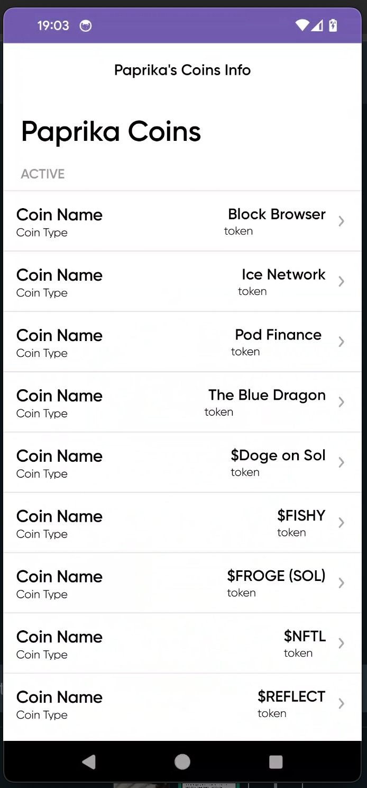
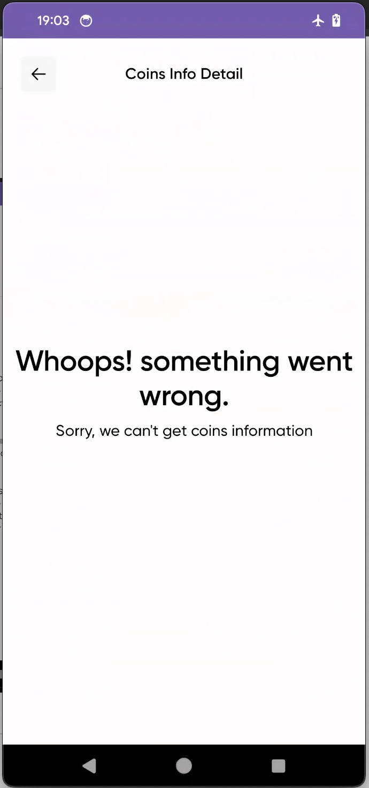

# Android News UK Application
- Shows a list of coins and the details of each coin.

# The tech stack and the architecture used are:
- Clean Architecture with 3 Layers Architecture, "Presentation Layer", "Domain Layer" and "Data Layer" and MVVM pattern with Kotlin
- Dagger-Hilt for Dependency Injection
- Jetpack Compose UI tools
- MockK for Unit testing
- Coroutine (Kotlin flows)for background UI thread processing data
- Main Jetpack Components including ViewModel

---
- Showing the list of coins and the details of each coin.

  

  

- If there is error so get the list of coins and the details of each coin.

  

  

